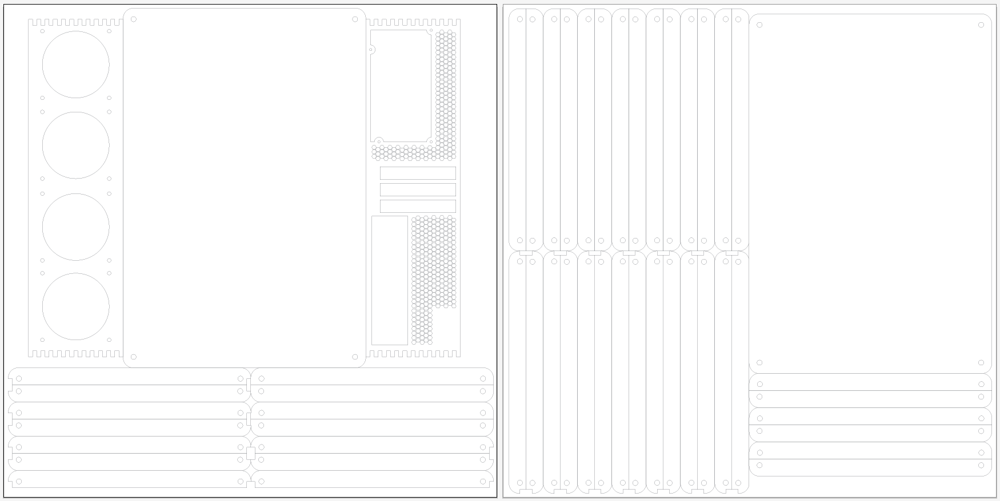

# Custom laser cut Mini ATX case design

Plans designed for use with .2in (5.08mm) thick material.

###Materials tested:
* Birch Plywood (est cost ~$20 for 3x 24in(609.6mm) by 24in(609.6mm) sheets)

###Materials needed:

* 6 square feet of materials (wood or acrylic)
* 2x 1/4in threaded rod (allthread)
* 8x 1/4in nuts
* 4x 1/4 threaded case feet
* 

