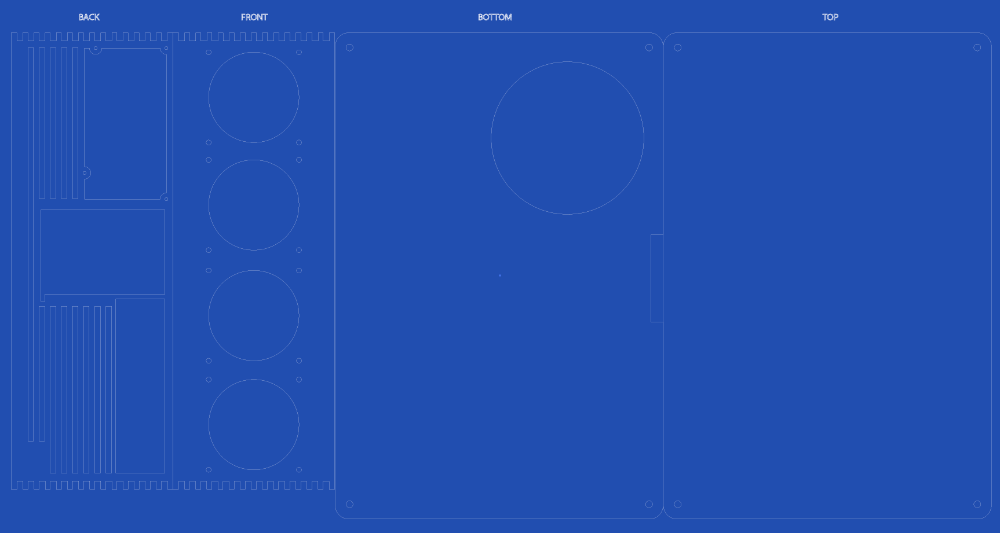

# Custom laser cut Mini ATX case design

Prototypes cut at [LVL1 Hackerspace, Louisville, KY](http://lvl1.org), Thanks LVL1!

###Materials tested:
* Birch Plywood (est cost ~$12 for 2x 24in by 48in sheets)

###Materials needed:

* 2x 2'x4' sheets of .2in (5.08mm) thick material (wood or acrylic probably ideal)
* 2x 1/4in threaded rod (allthread)
* 8x 1/4in nuts
* 4x 1/4 threaded case feet

###To Do
* Look into making version of design for 1/4" material since 1/4" X 24"x 24" is a standard size for Plexiglass acrylic)
* Est cost for 3 sheets of 1/4" X 24"x 24" Acrylic is $63
